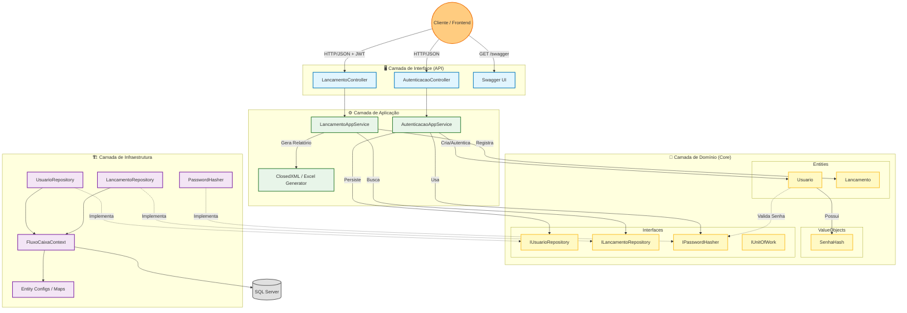

# 🏗️ Desenho da Solução - FluxoCaixa

Este documento ilustra a arquitetura da solução após a refatoração para DDD (Domain-Driven Design) e princípios SOLID.

## 📊 Diagrama de Componentes (C4 Level 2/3)

## 📝 Descrição dos Componentes

### 1. Camada de Interface (API)
Ponto de entrada da aplicação.
- **Controllers**: Recebem requisições HTTP, validam o modelo de entrada (DTOs/ViewModels) e delegam para o AppService. Não contém regras de negócio.
- **Segurança**: Configurada com JWT Bearer Authentication.

### 2. Camada de Aplicação
Orquestra os fluxos de caso de uso.
- **AutenticacaoAppService**: Gerencia login, registro e geração de token JWT. Coordena a interação entre a Entidade `Usuario`, o Hash de senha e o Repositório.
- **LancamentoAppService**: Gerencia lançamentos financeiros e possui a lógica específica de geração de relatórios em Excel (usando `ClosedXML`).

### 3. Camada de Domínio (O Coração)
Contém as regras de negócio puras e imutáveis em relação à tecnologia.
- **Usuario (Entidade Rica)**: Possui comportamentos como `Autenticar`, `Criar` (Factory) e validações internas. Não é mais apenas um saco de getters/setters.
- **SenhaHash (Value Object)**: Garante que senhas trafeguem apenas criptografadas dentro do domínio.
- **Interfaces**: Define contratos para Repositórios e Serviços (`IPasswordHasher`), garantindo o princípio DIP (Dependency Inversion Principle) do SOLID.

### 4. Camada de Infraestrutura
Implementa as interfaces definidas pelo domínio e lida com detalhes técnicos.
- **Repositories**: Usam Entity Framework Core para acesso a dados.
- **PasswordHasher**: Implementação concreta usando `Microsoft.AspNetCore.Identity` para hash seguro, mas encapsulado para não poluir o domínio.
- **FluxoCaixaContext**: Contexto do EF Core, mapeando as entidades e VOs (como `OwnsOne` para `SenhaHash`).

---

## 🔄 Fluxos Principais

### Fluxo de Autenticação
1. **API** recebe credenciais.
2. **AppService** busca usuário pelo email no Repositório.
3. **AppService** chama método `Usuario.Autenticar()`.
4. **Domínio** valida o hash da senha usando `IPasswordHasher`.
5. Se válido, **AppService** gera e retorna JWT.

### Fluxo de Relatório
1. **API** recebe a data para o relatório.
2. **AppService** solicita ao Repositório os lançamentos daquela data específica.
3. **AppService** processa os dados, calcula o saldo final (Crédito - Débito) e usa `ClosedXML` para gerar o binário do Excel com totalizadores.
4. **API** retorna o arquivo `.xlsx` para download.
